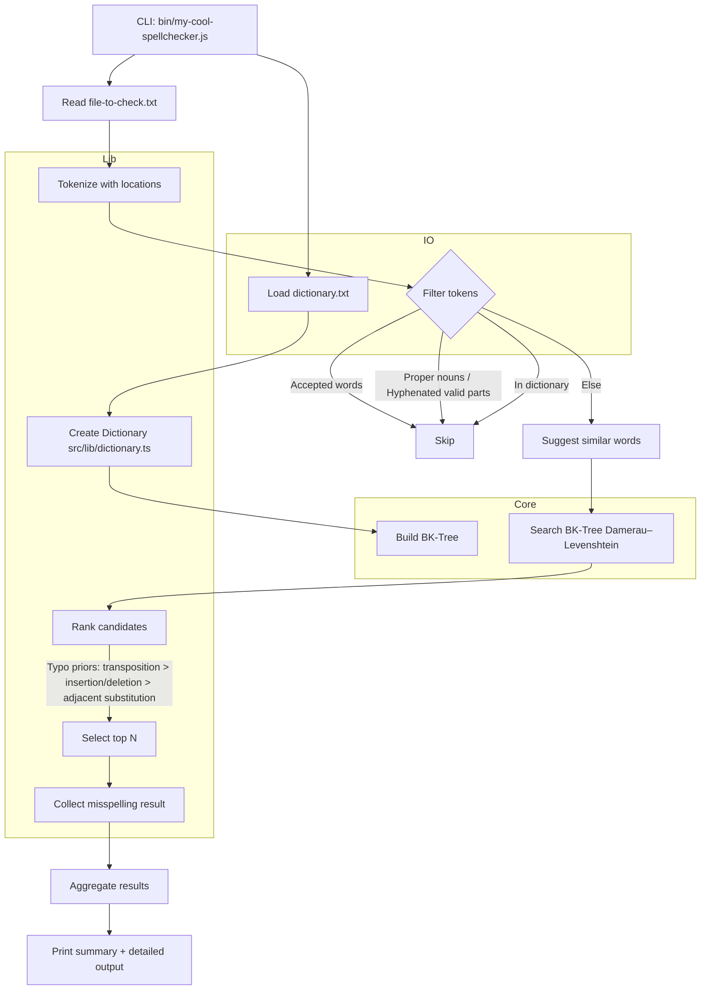

# Spell Checker – High-level Architecture

This diagram explains how the CLI flows from inputs to outputs, and how modules interact.

Key points

- Inputs: `dictionary.txt`, `file-to-check.txt`
- Word lists: `words/uncommon-words.txt` (deprioritize ties), `words/accepted-words.txt` (always accept)
- Algorithms: BK-tree + Damerau–Levenshtein; heuristic ranking for common typing errors
- Output: summary list of misspelled words, then per-word context and suggestions

Modules

- CLI: `bin/my-cool-spellchecker.js`
- Core structures: `src/core/bktree.ts`
- Spellcheck pipeline: `src/lib/{dictionary.ts, spellcheck.ts, suggest.ts}`
- IO helpers: `src/io/{uncommonWords.ts, whitelist.ts}`
